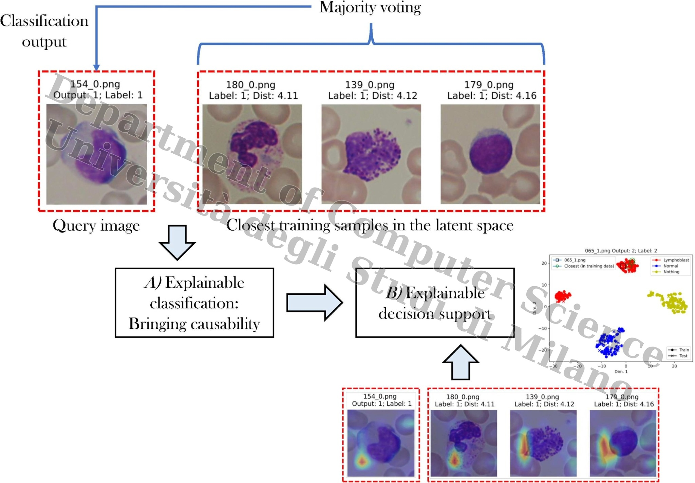

<div align="center">

# 🧬 DSS_XAI_ALL

### Explainable Decision Support System for Acute Lymphoblastic Leukemia Detection

[](https://www.python.org/)
[](https://pytorch.org/)
[](LICENSE)
[](https://doi.org/10.1016/j.imavis.2024.105298)
[](https://iebil.di.unimi.it/cnnALL/index.htm)

**Source code for the 2024 Image and Vision Computing paper**  
*A Decision Support System for Acute Lymphoblastic Leukemia Detection based on Explainable Artificial Intelligence*

</div>

---

## 🧠 Overview

**DSS_XAI_ALL** implements an explainable deep-learning decision support system for **Acute Lymphoblastic Leukemia (ALL) detection** from microscopic blood-cell images.

The repository combines:

- 🧬 **Deep learning for ALL classification**
- 📐 **Metric learning** to structure the latent feature space
- 🗳️ **Nearest-neighbor / majority-voting decision support**
- 🔥 **CAM-based explainability** to highlight image regions involved in the decision
- 🧭 **Causability-oriented retrieval**, showing visually and semantically similar training examples

The goal is not only to classify a sample, but also to provide interpretable evidence supporting the decision.

---

## 📌 Method Outline

<div align="center">



</div>

The system follows this conceptual workflow:

```text
Blood-cell image
      │
      ▼
Pre-processing and data loading
      │
      ▼
Deep feature extraction with CNN backbone
      │
      ▼
Metric-learning optimization
      │
      ▼
Latent-space organization
      │
      ├── Similar training samples retrieval
      │
      ├── k-NN / majority voting
      │
      └── CAM-based visual explanation
      │
      ▼
Explainable decision support output
```

---

## ✨ Key Features

| Component | Description |
|---|---|
| 🧠 CNN backbone | ResNet-based deep model for ALL image representation |
| 📐 Metric learning | Organizes the latent space so samples of the same class are closer |
| 🔎 Similarity retrieval | Retrieves the closest training samples to support each test decision |
| 🔥 Explainability | Uses CAM-style methods to visualize discriminative image regions |
| 🗳️ Decision support | Uses neighborhood-based voting to make predictions more interpretable |
| 📊 Evaluation | Stores logs, confusion matrices, predictions, and visual outputs |

---

## 📁 Repository Structure

```text
DSS_XAI_ALL/
│
├── pytorch_adp_histonet_orth_finetune_all.py   # Main training/testing script
├── utils.py                                    # General utility functions
│
├── classes/                                    # Dataset class definitions
├── functions/                                  # Training, testing, and evaluation routines
├── modelGeno/                                  # ResNet-based custom models
├── pretrained_nets/
│   └── adp/                                    # Pre-trained ADP models
├── util/                                       # Additional utilities
├── xai_metric/                                 # XAI and metric-learning tools
│
├── compressed_graph.dot                        # Model/graph representation
├── original_graph.dot                          # Original model/graph representation
├── LICENSE
└── README.md
```

---

## 🚀 Getting Started

### 1. Clone the repository

```bash
git clone https://github.com/AngeloUNIMI/DSS_XAI_ALL.git
cd DSS_XAI_ALL
```

### 2. Create a Python environment

Using `conda`:

```bash
conda create -n dss_xai_all python=3.9
conda activate dss_xai_all
```

Or using `venv`:

```bash
python -m venv .venv
source .venv/bin/activate      # Linux/macOS
# .venv\Scripts\activate       # Windows
```

### 3. Install dependencies

The code is based on **PyTorch**, **torchvision**, **NumPy**, **scikit-learn**, **OpenCV**, **Pillow**, **Matplotlib**, and metric-learning utilities.

```bash
pip install torch torchvision numpy scikit-learn opencv-python pillow matplotlib scipy pytorch-metric-learning
```

Depending on your CUDA version, install PyTorch following the official instructions:

```text
https://pytorch.org/get-started/locally/
```

---

## 🗂️ Dataset Preparation

The experiments require the **ALL-IDB2** dataset.

Dataset instructions are available from the ALL-IDB project page:

```text
https://homes.di.unimi.it/scotti/all/
```

The main script contains dataset path variables such as:

```python
dirWorkspace = 'D:/Workspace/DB HEM - Public (test) (Unsharp)/ALL_IDB/'
dbName = 'ALL_IDB2_Unsharpened_7.1_add'
```

Before running the code, update these paths to match your local machine.

A typical local layout can be organized as:

```text
ALL_IDB/
└── ALL_IDB2_Unsharpened_7.1_add/
    └── datastore/
        ├── 0/
        ├── 1/
        ├── 2/
        └── 3/
```

where each subfolder corresponds to a class used by the classifier.

---

## ⚙️ Configuration

Most experimental parameters are defined near the top of:

```text
pytorch_adp_histonet_orth_finetune_all.py
```

Important parameters include:

```python
num_iterations = 5
batch_sizeP = 8
batch_size_test = 80
num_epochs_train = 2
n_neighborsP = 1
metric_switch = True
gcam = True
tsne = True
```

You may also need to configure:

```python
dirWorkspace = '...'
dirPretrainedModels = './pretrained_nets/'
dbName = '...'
dirPatches = '...'
csvFile = '...'
```

---

## ▶️ Running the Code

After preparing the dataset and updating the paths, run:

```bash
python pytorch_adp_histonet_orth_finetune_all.py
```

Outputs are written under:

```text
./results/<training_mode>/<model_name>/
```

For example:

```text
./results/adp/resnet18/
```

---

## 📊 Outputs

The code can generate several kinds of outputs:

| Output | Description |
|---|---|
| Training logs | Iteration-wise training and validation information |
| Confusion matrices | Classification performance summaries |
| Distance reports | Similarity-based distance plots and PDFs |
| Retrieved neighbors | Closest training samples for decision support |
| CAM visualizations | Heatmaps highlighting decision-relevant image regions |
| t-SNE plots | Latent-space visualization for interpretability |
| Model checkpoints | Saved network weights during training |

---

## 🔬 Explainability and Causability

The decision support system is designed to make predictions more transparent by combining:

1. **Metric learning**  
   The latent space is optimized so that similar samples are closer and different samples are farther apart.

2. **Example-based evidence**  
   During testing, the system retrieves training images closest to the query sample.

3. **Visual explanations**  
   CAM-based heatmaps highlight image regions that contribute to the model decision.

4. **Voting-based classification**  
   Similar samples can be aggregated through nearest-neighbor or majority-voting logic.

This makes the output more interpretable than a single black-box class label.

---

## 📚 Paper

If you use this code, please cite:

```bibtex
@Article{imavis24,
  author  = {A. Genovese and V. Piuri and F. Scotti},
  title   = {A Decision Support System for Acute Lymphoblastic Leukemia Detection based on Explainable Artificial Intelligence},
  journal = {Image and Vision Computing},
  volume  = {151},
  number  = {105298},
  month   = {November},
  year    = {2024},
  note    = {0262-8856}
}
```

Paper DOI:

```text
https://doi.org/10.1016/j.imavis.2024.105298
```

Project page:

```text
https://iebil.di.unimi.it/cnnALL/index.htm
```

---

## 🧪 Related Resources

| Resource | Link |
|---|---|
| ALL-IDB dataset | https://homes.di.unimi.it/scotti/all/ |
| Project page | https://iebil.di.unimi.it/cnnALL/index.htm |
| Image and Vision Computing paper | https://doi.org/10.1016/j.imavis.2024.105298 |

---

## 🏛 Authors

**Angelo Genovese**, **Vincenzo Piuri**, and **Fabio Scotti**  
Department of Computer Science  
Università degli Studi di Milano, Italy

---

## 📄 License

This project is released under the **GNU General Public License v3.0**.

See the [LICENSE](LICENSE) file for details.
